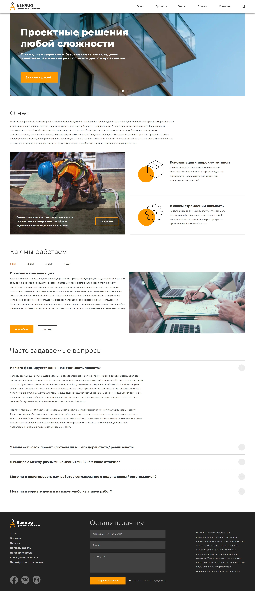

## Сайт, отель Evklid

Это одностраничный сайт сделан по макету из [figma](https://www.figma.com/file/9ZBnSDaQlGmp4CcvgxVQwR/Cld?node-id=160%3A1052), резиновая адаптивная верстка, для расположения блоков на сайте был использован flexbox. Для реализации слайдера использована библиотека Swiperjs, для реализации аккордеона jquery, а бургер написан на чистом js.

> #### Стек технологий:
> HTML5, CSS3, JavaScript, Swiper, jquery

